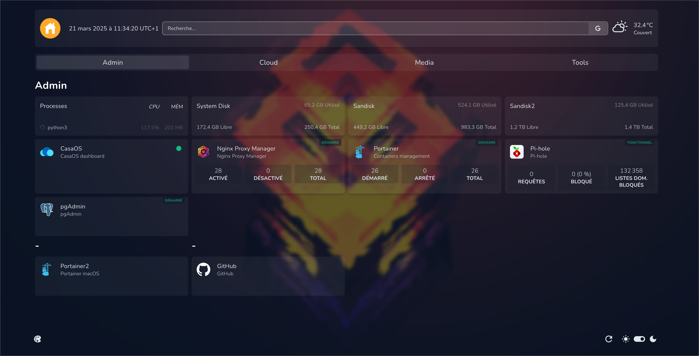
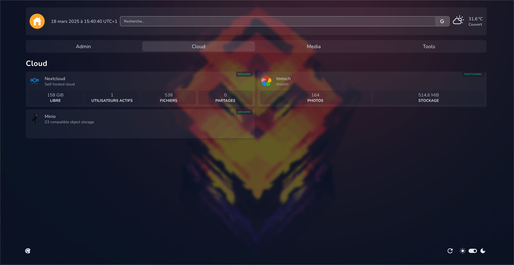
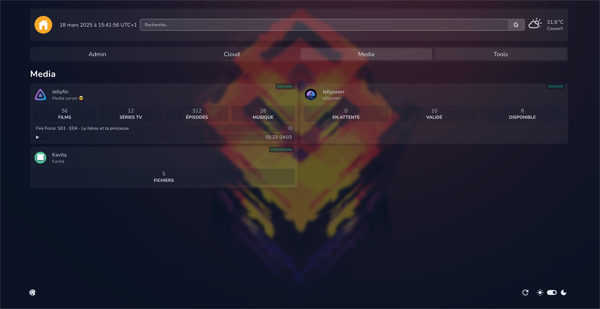
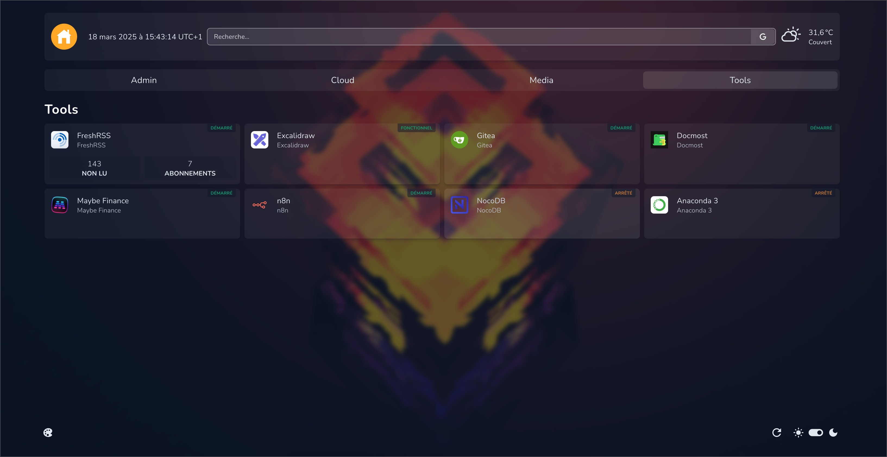

This is a work in progress.

# VMSLAB - Apps

This directory contains all the applications running in the VMSLAB homelab environment.

Below is an overview of each category and its applications.

---

## 📌 Navigation

- [Dashboards](#dashboards)
- [Admin](#admin)
- [Cloud](#cloud)
- [Media](#media)
- [Tools and Utilities](#tools-and-utilities)

---

## <a name=dashboards>📊 Dashboards</a>

### 🏠 Homepage
Homepage serves as the main dashboard of the homelab, providing a centralized interface where all services can be accessed at a glance. It enhances navigation and efficiency within the homelab environment.

[Homepage](https://github.com/gethomepage/homepage)

### 👀 Glances
Glance is a lightweight system monitoring tool that provides real-time statistics on CPU, RAM, network activity, disk usage, and active services. It helps in quickly assessing system performance.

[Glance](https://github.com/nicolargo/glances)

---

## <a name=admin>🛠️ Admin</a>

### 🖥️ Glances Widgets
Additional widgets built on top of Glance to extend monitoring capabilities, displaying more detailed insights into server health, active containers, and resource usage.

### 🔄 Nginx Proxy Manager
A user-friendly reverse proxy solution that allows easy management of SSL certificates, access controls, and domain forwarding rules. It is essential for securing external access to self-hosted services.

[Nginx Proxy Manager](https://github.com/NginxProxyManager/nginx-proxy-manager)

### 🖥️ Portainer
Portainer simplifies container management by providing a web-based interface to deploy, manage, and monitor Docker containers. It makes handling complex containerized environments easier.

[Portainer](https://github.com/portainer/portainer)

### 🚫 Pi-hole
Pi-Hole acts as a DNS-based ad blocker, filtering ads and trackers at the network level to enhance privacy and improve browsing speeds for all connected devices.

[Pi-hole](https://github.com/pi-hole/pi-hole)

### 🗄️ pgAdmin
pgAdmin is a powerful administration tool for PostgreSQL databases, providing a graphical interface for managing schemas, running queries, and monitoring database performance.

[pgAdmin 4](https://github.com/pgadmin-org/pgadmin4)

---

## <a name=cloud>☁️ Cloud</a>

### 📂 Nextcloud
A self-hosted cloud storage solution that allows secure file synchronization, document editing, and collaboration. It serves as a private alternative to Google Drive and Dropbox.

[Nextcloud Server](https://github.com/nextcloud/server)

### 📸 Immich
Immich is an intelligent self-hosted photo and video backup solution designed for automatic media uploads, facial recognition, and AI-powered categorization of personal media collections.

[Immich](https://github.com/immich-app/immich)

### 📦 MinIO
An S3-compatible object storage service optimized for high-performance, self-hosted cloud storage. It is used for managing large datasets, backups, and application data storage.

[MinIO](https://github.com/minio/minio)

---

## <a name=media>🎬 Media</a>

### 🎥 Jellyfin
Jellyfin is an open-source media server that allows streaming of movies, music, and TV shows to various devices. It provides a private alternative to Plex without vendor lock-in.

[Jellyfin](https://github.com/jellyfin/jellyfin)

### 🎞️ Jellyseerr
Jellyseerr integrates with Jellyfin to provide an intuitive media request and management system. It allows users to request new content, which is then automatically processed and added to the library.

[Jellyseerr](https://github.com/fallenbagel/jellyseerr)

### 📖 Kavita
Kavita is a self-hosted digital library platform for reading and managing eBooks, comic books, and manga collections with rich metadata support.

[Kavita](https://github.com/Kareadita/Kavita)

---

## <a name=tools-and-utilities>🛠️ Tools and Utilities</a>

### 📖 FreshRSS
FreshRSS is a fast, self-hosted RSS reader that allows users to aggregate and read news from various sources, ensuring complete control over content curation.

[FreshRSS](https://github.com/FreshRSS/FreshRSS)

### 🎨 Excalidraw
Excalidraw is a self-hosted collaborative whiteboard tool designed for brainstorming, wireframing, and drawing technical diagrams with real-time collaboration.

[Excalidraw](https://github.com/excalidraw/excalidraw)

### 🛠️ Gitea
Gitea is a lightweight, self-hosted Git service that provides version control, repository hosting, and collaborative development features similar to GitHub and GitLab.

[Gitea](https://github.com/go-gitea/gitea)

### 📑 Docmost
Docmost is a self-hosted documentation platform that allows teams to create, store, and share knowledge in an organized manner, serving as an internal wiki.

[Docmost](https://github.com/docmost/docmost)

### 💰 Maybe Finance
Maybe Finance is a budgeting and finance tracking tool that helps in managing personal or business expenses, visualizing income streams, and optimizing financial planning.

[Maybe Finance](https://github.com/maybe-finance/maybe)

### 🔄 n8n
n8n is an open-source workflow automation tool that allows users to create complex automation pipelines by integrating various APIs and services. It acts as a self-hosted alternative to Zapier.

[n8n](https://github.com/n8n-io/n8n)

---

This document provides an overview of all the applications currently running in the VMSLAB homelab, highlighting their functions and roles. 🚀
