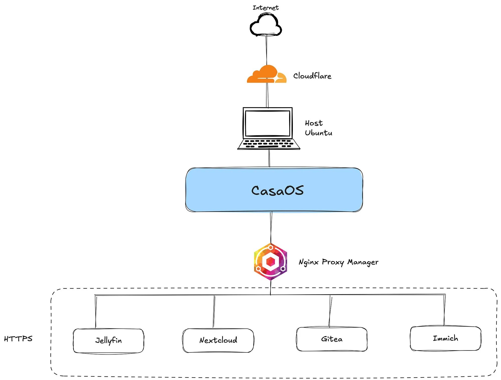

# Proxy Configuration for VMSLAB

This directory contains configurations and resources related to the reverse proxy setup for the VMSLAB homelab environment. A reverse proxy enhances security, performance, and flexibility by managing client requests to various backend services.

## Overview

In the VMSLAB setup, we utilize Nginx Proxy Manager in conjunction with Cloudflare to manage and secure access to our self-hosted services. This combination allows for simplified SSL certificate management, enhanced security features, and a user-friendly interface for managing proxy hosts.

**Components**

- **Nginx Proxy Manager:** Provides a web-based interface to manage Nginx reverse proxy configurations, including SSL certificate handling, access controls, and monitoring.
- **Cloudflare:** Acts as a content delivery network and security layer, offering DNS management, SSL/TLS encryption, and protection against various online threats.

## Setup Guide
1. **Install Nginx Proxy Manager:** Deploy Nginx Proxy Manager using Docker to facilitate easy management of proxy configurations.

2. **Configure Cloudflare:**
	- Register a domain and add it to your Cloudflare account.
	- Set up DNS records pointing to your homelab’s public IP address.
	- Enable SSL/TLS encryption and configure security settings as needed.
3. **Integrate Nginx Proxy Manager with Cloudflare:**
	- Use Cloudflare’s DNS challenge to obtain SSL certificates for your services.
	- Configure proxy hosts in Nginx Proxy Manager, specifying the domain, forwarding details, and SSL settings. 
4. **Manage Services:**
	- Add your self-hosted services to Nginx Proxy Manager as proxy hosts.
	- Ensure each service is accessible via its designated domain or subdomain with SSL encryption.

### Benefits
- Simplified Management: The web interface of Nginx Proxy Manager allows for easy addition, modification, and monitoring of proxy hosts.
- Enhanced Security: Cloudflare provides DDoS protection, secure DNS management, and SSL/TLS encryption, safeguarding your homelab services.
- Automated SSL Certificates: Leveraging Cloudflare’s DNS challenge, SSL certificates can be issued and renewed automatically, ensuring secure connections without manual intervention.

## References

For a detailed walkthrough and additional insights, refer to the original article:
[Local SSL Certificate for Your Homelab: CasaOS, Cloudflare, and Nginx Proxy Manager](https://medium.com/bugbountywriteup/local-ssl-certificate-for-your-homelab-4c42a6db0e80).