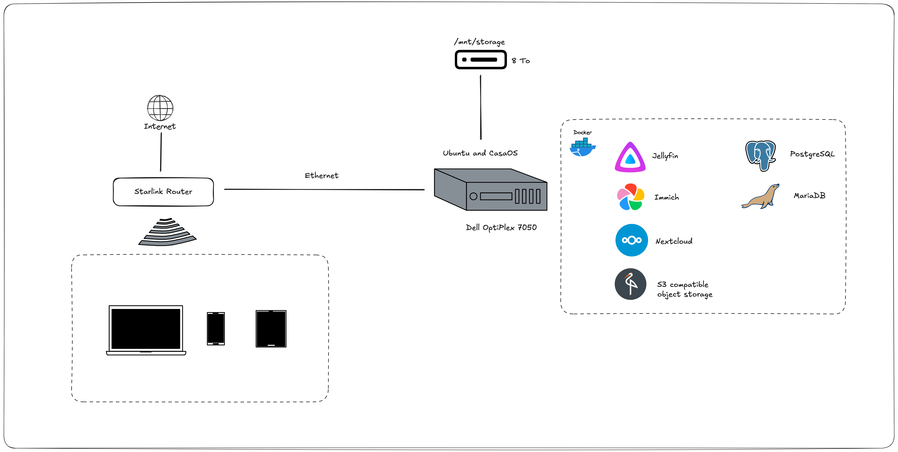

# My Homelab Setup : VMSLAB
My Homelab documentation files, stacks and resources! 

[](https://github.com/vidjinnangni/vmslab/tags)
[](https://docs.vmslab.work)
[](https://creativecommons.org/licenses/by/4.0/)

**Project status:** ALPHA

This is a work in progress. I still have a ton to update and add.
## Structure
```
VMSLAB/
├── Apps/           # Features all the self-hosted apps running in my homelab
├── Images/         # Diagrams, screenshots, and visual assets
├── Proxy/          # Reverse proxy
├── Roadmap/        # Future plans and development roadmap
└── README.md       # Project documentation
```
- **[Apps](./Apps/)**
- **[Proxy](./Proxy/)**
- **[Roadmap](./Roadmap/)**

## Hardware

### Servers
#### Dell OptiPlex 7050 (Ubuntu and CasaOS)
This laptop serves as the main server for my homelab. It hosts multiple services, mainly for media and cloud storage, ensuring easy access to my files and multimedia content.

- **CPU:** Intel Core i7 6700 @ 3,4 GHz
- **RAM:** 32GB DDR4 SDRAM
- **Storage:** 256GB SSD (Boot Drive) + 3TB External Drive (`/mnt/storage`)

**Operating System:** Ubuntu 24.04.2 LTS

**Management Interface:** [CasaOS](https://github.com/IceWhaleTech/CasaOS)

### Networking
Current Setup:

- **Internet Connection:** Starlink Standard (motorized kit) providing global satellite-based broadband access.
- **Router:** Starlink Router, handling NAT, DHCP, and firewall rules.
- **Main Server Connection:** Connected via Ethernet for stable performance and minimal latency.
- **LAN Devices:** Various client devices (laptops, smartphones, tablets) connect via Wi-Fi, accessing services hosted on the Dell Latitude E5470.
- **Subnet Structure:** Default Starlink private IP allocation with a standard 192.168.x.x addressing scheme.

**Future Plans:** Implementation of VLANs, more advanced firewall rules, and possibly a dedicated router/firewall solution (e.g., pfSense or OPNsense) for better control and security.

## 🚀 Future Plans

This project is in **Alpha** stage, meaning a lot is subject to change.

**Planned improvements:**

- Adding more compute power (possibly a dedicated server or mini PC)
- Expanding storage with RAID/NAS setup
- Improving networking with VLANs and better firewall rules
- Experimenting with virtualization (Proxmox, ESXi, etc.)

## 🤝 Contributing

If you have suggestions or want to contribute, feel free to open an issue or a pull request. Feedback is always welcome!

---

**🔗 Stay tuned for updates!**