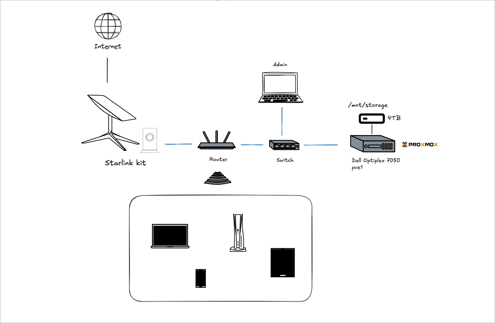

# My Homelab Setup: VMSLAB
This is an open lab journal where I document the process of building, configuring, and learning about my homelab. My goal is to self-host as many services as possible using [Proxmox VE](https://www.proxmox.com/) and containerized applications.

Along the way, I’ll share my mistakes, optimizations, scripts, and setup guides to help other homelab enthusiasts, especially beginners, get started and learn by example. **Hopefully helpful for fellow beginners**!

[](https://creativecommons.org/licenses/by/4.0/)

**Project status:** ALPHA

This is a work in progress. I still have a ton to update and add.
## Repository structure
```
VMSLAB/
├── Images/         # Diagrams, screenshots, and visual assets
├── Resources/      # Resources for Homelabing
├── Stack.md        # Features all the self-hosted apps running in my homelab
└── README.md       # Project documentation
```

## Hardware

### Servers
#### Dell OptiPlex 7050
Serves as the main server for my homelab.

- **CPU:** Intel Core i7 6700 @ 3,4 GHz
- **RAM:** 32GB DDR4 SDRAM
- **Storage:** 256GB SSD (Boot Drive) + 4TB External Drive (`/mnt/storage`)

**Operating System:** Proxmox PVE

### Networking
Current Setup:

- **Internet Connection:** Starlink Standard (motorized kit), providing global satellite-based broadband access via the Starlink satellite constellation.
- **Router:**
	- TP-Link Archer C6 replaces the default Starlink router.
	- Handles NAT, DHCP, firewall, and Wi-Fi access (2.4 GHz & 5 GHz).
	- Connected to Starlink via the official Ethernet adapter.
- **Switch:**
	- TP-Link TL-SG605E (5-Port Gigabit Smart Switch) used for wired device distribution.
	- Enables VLAN configuration, QoS, and traffic monitoring via its web interface.
- **Main Server Connection:** Dell OptiPlex 7050, connected via Ethernet to the switch for stable performance and low latency.
- **LAN Devices:** Various client devices (laptops, smartphones, tablets, smart TVs) connect via Wi-Fi or Ethernet through the router and switch. Devices access both the Internet and internal services hosted on the main server.
- **Subnet Structure:**
	- Internal network uses 192.168.0.0/24 private addressing (default for TP-Link routers).
	- DHCP server on the Archer C6 manages IP distribution for all LAN clients.

```
[Starlink Standard Motorized Kit]
│
[Ethernet Adapter]
│
[TP-Link Archer C6 – WAN Port]
│
[TP-Link Archer C6 – LAN Port 1]
│
[TL-SG605E (Switch)]
├── PC
├── NAS / Network Printer
├── Smart TV
└── Game Console
```
---
## PVE


My homelab runs on **Proxmox VE (Virtual Environment)**, an open-source virtualization platform that supports both:

- containers (LXC)
- and virtual machines (KVM).

I’ve structured the setup to focus primarily on **lightweight, containerized services using LXC**, while keeping a few virtual machines for specific or isolated use cases.

#### **Host overview**
| **Component**  | **Description**             | **Mount Point** |
|----------------|-----------------------------|-----------------|
| **Proxmox Host** | Main virtualization server  |                 |
| **Boot drive** | 256GB SSD  |                 |
| **Storage**       | External USB HDD (4TB)     | /mnt/storage      |

The Proxmox host runs on a dedicated machine with a 256 GB SSD for the OS and LXC root filesystems, while larger data and container volumes are mounted from external USB drives.

### 📦 LXC Containers

LXC containers form the core of my infrastructure. They are lightweight, fast to deploy, and well-suited for hosting most of my self-hosted services. Here’s an overview of my current containers:

| **LXC ID** | **Hostname**   | **Role / Main App(s)**                                  |
|------------|----------------|----------------------------------------------------------|
| 100        | `npm`          | Nginx Proxy Manager (reverse proxy & SSL management)     |
| 101        | `pihole`       | DNS Filtering + Network-wide Ad Blocking                 |
| 102        | `portainer`    | UI for managing Docker containers                        |
| 103        | `docker-apps`  | Host for multiple containerized services (via Docker)    |
| 104        | `postgres`     | PostgreSQL database server                               |
| 105        | `mariadb`      | MariaDB database server                                  |
| 106        | `minio`        | S3-compatible Object Storage                             |
| 107        | `nextcloud`    | File Sync & Collaboration Platform                       |
| 108        | `immich`       | Self-hosted Photo Library (like Google Photos)           |
| 109        | `torrent`      | qBittorrent for torrent downloads                        |
| 110        | `podman`       | Experimental container runtime environment (Docker alt)  |
| 111        | `samba`        | SMB file sharing server                   |
| 112        | `k3s`          | Lightweight Kubernetes cluster for experimentation       |

This container-first approach keeps the system **lightweight**, **with low overhead and quick snapshot/backup capabilities**.

### 💻 Virtual Machines (VMs)

I also run a couple of VMs for use cases where containers are less suitable or when isolation is critical.

| **VM ID** | **Hostname**     | **OS / Purpose**                                      |
|-----------|------------------|--------------------------------------------------------|
| 1000      | `ubuntu-server`  | Ubuntu Server 22.04 used as a secondary Docker host (for testing and sandboxing) |
| 1001      | `umbrelos`       | UmbrelOS – for fun and testing |

### **🗂️ Homelab File Structure**

```bash
/opt/homelab/
├── docker/
│   └── services/         # Docker Compose files for each app
├── scripts/              # Utility scripts (backup, update, restore...)
/mnt/
├── storage/              # 4TB USB Drive – media / downloads / backups
```
This directory layout helps keep the homelab organized and maintainable.

Docker-related configurations are isolated under `/opt/homelab/docker`, while general-purpose automation and utility scripts live under `/opt/homelab/scripts`.

External drives are mounted under `/mnt/` for storing media, backups, and persistent data.

---

## 🚀 Future Plans

This project is currently in an **Alpha** stage — it's fully functional, but constantly evolving as I learn and experiment.

**Planned improvements and upgrades include:**

- 🖥️ **Adding more hardware.** Planning to expand the lab with additional compute nodes, such as a mini PC, a low-power server (e.g., Dell OptiPlex or Intel NUC), or second-hand rackmount hardware.

- 🔗 **Building a small cluster.** Exploring Proxmox clustering to manage multiple nodes and enable features like live migration, HA (High Availability), and distributed workloads.

- 📦 **Deep dive into Kubernetes.** Going beyond basic Docker usage by setting up a full Kubernetes (k3s/k8s) cluster for orchestrating containerized services across nodes.

- 🛠️ **Centralized configuration & automation.** Introducing tools like Ansible or Terraform to automate deployments, backups, monitoring, and upgrades.

- 🌐 **Network segmentation and security.** Refining LAN setup with VLANs, stricter firewall rules, and possibly adopting pfSense or OPNSense for better network control.

- 📊 **Improved monitoring and observability.** Setting up Prometheus, Grafana, or Netdata for real-time insight into system performance and services.

## 🤝 Contributing

If you have suggestions or want to contribute, feel free to open an issue or a pull request. Feedback is always welcome!

---
## License

This project is licensed under the [Creative Commons Attribution 4.0 International License (CC BY 4.0)](https://creativecommons.org/licenses/by/4.0/).