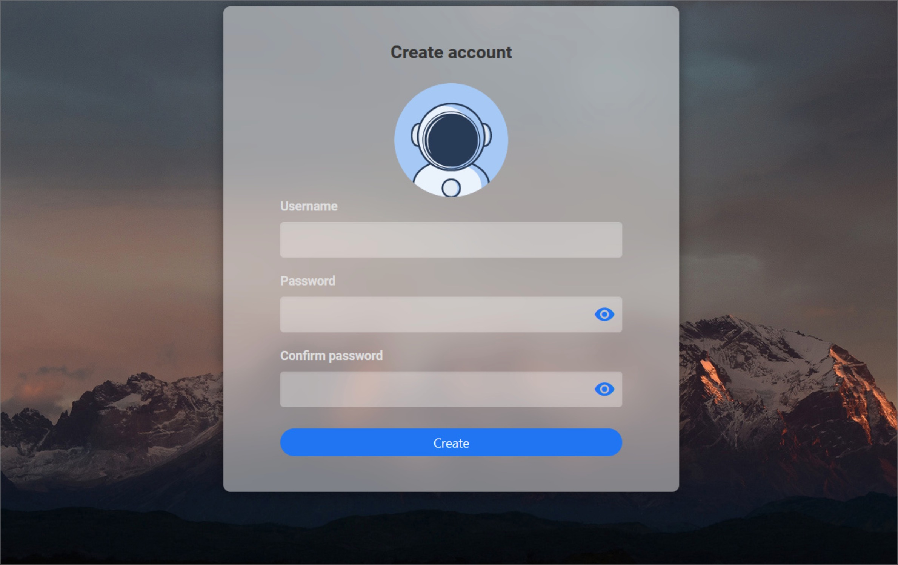

# CasaOS - A Simple Gateway to Your Homelab


## What is CasaOS?

[CasaOS](https://www.casaos.io/) is an open-source home server system designed to make self-hosting accessible to everyone. It turns a Raspberry Pi, mini PC, or virtual machine into a **personal server with an easy-to-use web interface**.

CasaOS is built on top of Linux (Ubuntu/Debian) and provides a friendly GUI to install and manage apps (powered by Docker) in just a few clicks.

---

## Why Use CasaOS?

- ✅ Beginner-friendly – no need for complex terminal commands
- 🧩 One-click apps – Jellyfin, Plex, Nextcloud, Pi-hole, and more
- 🌐 Clean and responsive web interface
- 📦 Docker-based – portable and modular
- 🛠️ Actively maintained by [IceWhaleTech](https://github.com/IceWhaleTech)

---

## How to Install CasaOS (on Ubuntu or Debian)

### 1. Requirements

- A machine running **Ubuntu 20.04+** or **Debian 11+**
- Terminal or SSH access
- A user with `sudo` privileges

> 💡 CasaOS fully supports ZimaBoard, Intel NUC, and Raspberry Pi. Also, more computers and development boards and fully compatible with Ubuntu, Debian, Raspberry Pi OS, and CentOS with one-liner installation.
	

### 2. Installation Command

Run the following command in your terminal:

```bash
curl -fsSL https://get.casaos.io | sudo bash
```

This script will install Docker and all required dependencies, and then set up CasaOS.

### 3. Access the Web Interface

Once installation is complete:

➡️ Open your browser and go to:
`http://[YOUR_DEVICE_IP]:80`

> 💡 When you access CasaOS for the first time in your browser, you’ll be greeted with a setup screen where you can create your admin account:



Set up your admin account, and you’re ready to explore!

---

### 🧪 Tested On

- ✅ Debian 12 (Recommended)
- ✅ Ubuntu 20.04 LTS
- ✅ Raspberry Pi (Raspberry Pi OS 64-bit)

---
### 🔗 Useful Links

- Official Website: [https://www.casaos.io](https://www.casaos.io)
- GitHub Repo: [IceWhaleTech/CasaOS](https://github.com/IceWhaleTech)
- Wiki: [https://wiki.casaos.io](https://wiki.casaos.io/en/home)
