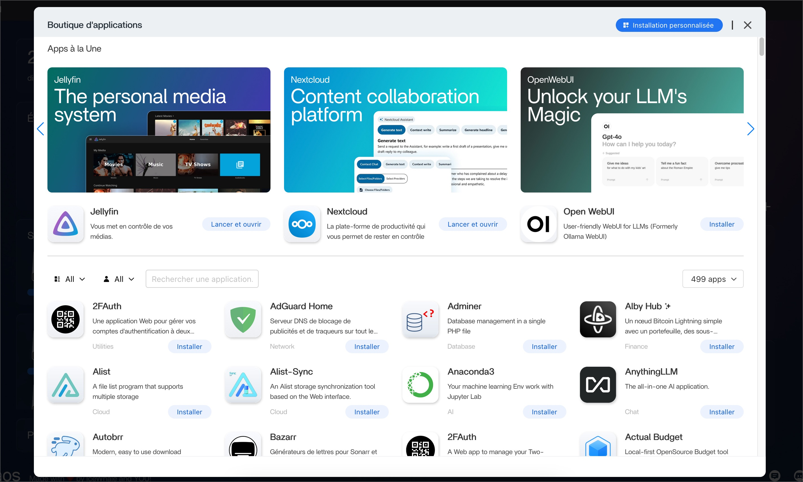
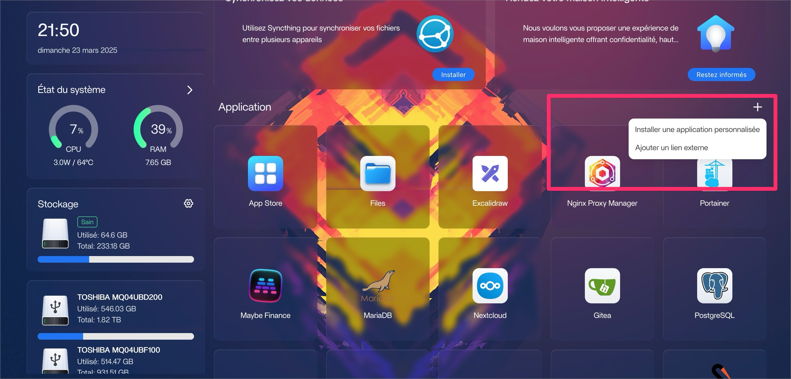
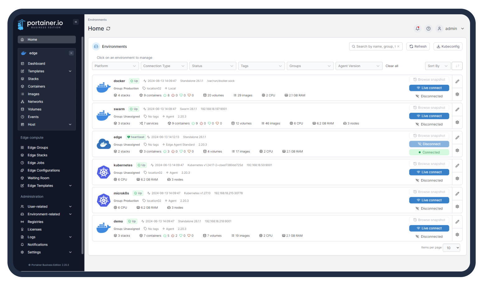

# Installing Applications on CasaOS

CasaOS supports multiple ways to install applications, making it flexible for both beginners and more advanced users. Here's a breakdown of the main methods available.

---

## 1. 📦 Install via CasaOS App Store (One-Click Install)


The easiest way to get started is through the built-in App Store.

### ✅ How it works:
- Go to the **"App Store"** section in the web UI
- Browse or search for available apps (e.g. Jellyfin, Nextcloud, Pi-hole)
- Click **"Install"** and CasaOS will handle everything via Docker

### Pros:
- Super easy, no config needed
- Pre-configured Docker containers with sensible defaults
- Visible in the CasaOS dashboard

---

## 2. ⚙️ Add Custom Docker App (via the UI)


If an app is not in the App Store, you can manually add a Docker container through the CasaOS interface.

### ✅ How to do it:
- On the main dashboard, click the **+** button in the “Applications” section
- Select “Install a custom app”
- Fill in the details:
  - Docker image (e.g. `ghcr.io/louislam/uptime-kuma`)
  - Port mapping
  - Volume mounts
  - Environment variables

>💡 You can add external web apps too (e.g. self-hosted tools running on another machine), using the “Add external link” option.

### Pros:
- Use any Docker image available online
- Still managed via the CasaOS UI

---

## 3. 💻 Install via Command Line (Advanced)

For more control, you can install apps directly with Docker CLI.

```bash
docker run -d \
  --name uptime-kuma \
  -p 3001:3001 \
  -v /mnt/data/kuma:/app/data \
  louislam/uptime-kuma
```
## 4. 🛠️ Using Portainer (for Advanced Docker Management)


[Portainer](https://www.portainer.io/) is a powerful web-based Docker management tool. It gives you full control over your containers, images, volumes, networks, and more — all through a clean UI.

### What you can do with Portainer:

- Deploy any Docker container with advanced configuration
- Monitor resource usage (CPU, RAM, network)
- Manage volumes, networks, and images
- Import/export Docker stacks
- Troubleshoot containers with logs and terminal access

### When to use it:

Use Portainer if:

- You need more control than the CasaOS UI offers
- You’re deploying multi-container apps (e.g., using docker-compose)
- You want to explore the full power of Docker while staying in GUI land

### Example: Deploying Whoogle via Portainer
1. Access Portainer (`http://192.168.1.X:9000`)
2. Go to Containers > Add container
3. Set name: whoogle
4. Image: benbusby/whoogle-search
5. Map port 5000:5000
6. Deploy container

The app will be available at `http://192.168.1.X:5000`

>**⚠️ Note:**

>- Apps installed via Portainer won’t appear in the CasaOS dashboard by default.
>- You can still manage them independently through Portainer.


