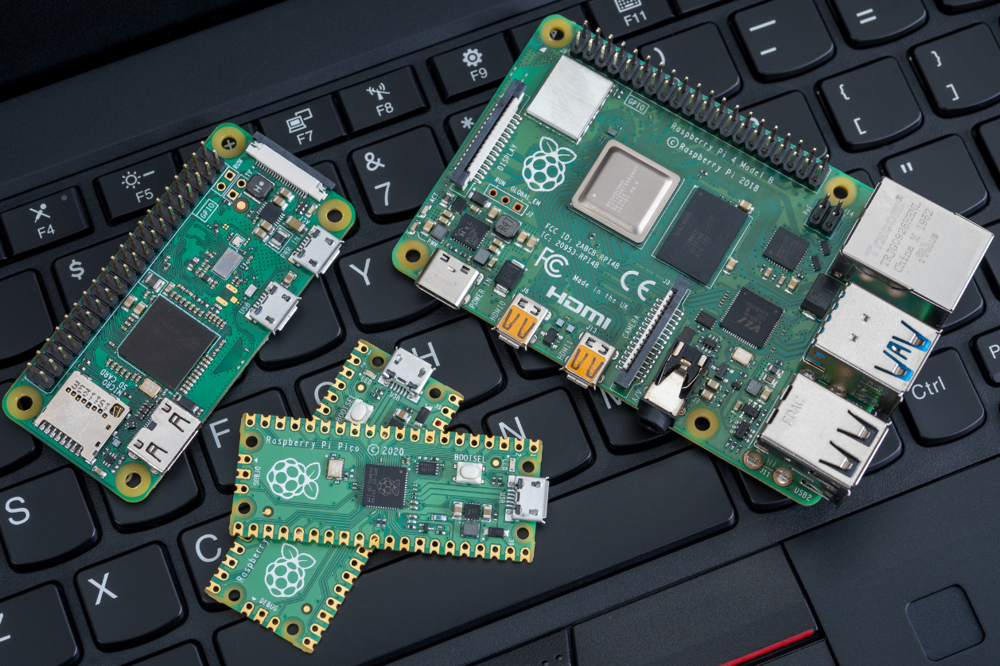
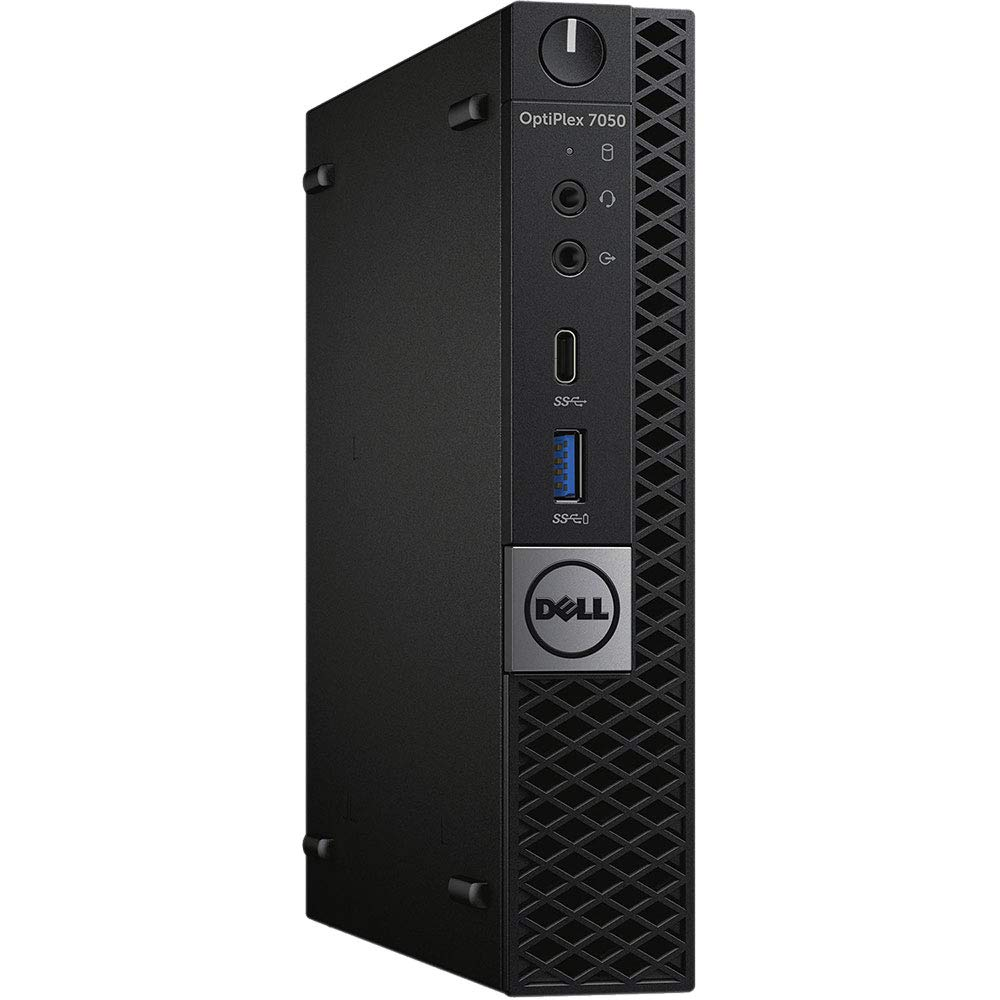
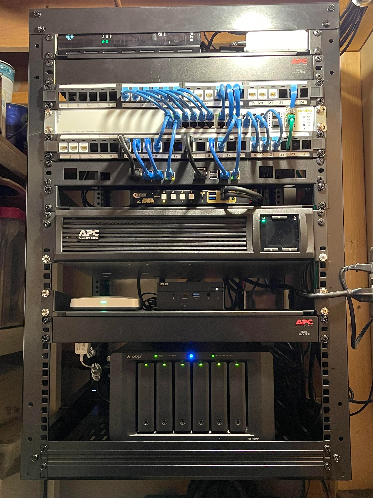

# 🏡 Introduction to Homelabs 

A **homelab** (short for "home laboratory") is a personal computing environment used for learning, experimentation, and self-hosting services. It can be as simple as a Raspberry Pi running a few services or as complex as a full-fledged data center with virtualized servers, advanced storage solutions, and security measures.  

## 🎯 Why Set Up a Homelab?  

People build homelabs for different reasons, but here are some of the most **common motivations**:  

1. **Learning & Experimentation** 📚  
   - Test new technologies like Docker, Kubernetes, or Proxmox.  
   - Develop skills in system administration and networking.  

2. **Self-Hosting & Digital Independence** 🌐  
   - Run personal cloud services, media servers, or email hosting.  
   - Gain control over your data and reduce reliance on big tech cloud providers.  

3. **Cybersecurity & Network Protection** 🔐  
   - Set up firewalls, VPNs, and reverse proxies.  
   - Experiment with monitoring and security tools.  

4. **Cost Savings & Hardware Reuse** 💰  
   - Repurpose old computers into powerful home servers.  
   - Replace paid cloud services with self-hosted alternatives.  

## 🏗️ What Do You Need to Get Started?  

A homelab can be as **simple or advanced** as you want. Here are some basic setups based on different experience levels:  

### 🥇 Beginner Setup

- A **Raspberry Pi** or an **old PC**  
- An external hard drive for storage  
- A **lightweight OS** like Debian, Ubuntu Server, or CasaOS  
- Basic self-hosted services like Nextcloud or Pi-hole  

### 🚀 Intermediate Setup

- A **mini-PC or refurbished server** (e.g., Dell OptiPlex, HP ProDesk)  
- A NAS (or networked drive) for storage  
- Docker with an orchestration tool like Portainer  
- Hosting multiple services like Jellyfin, Home Assistant, and Immich  

### 💡 Advanced Setup  

© u/JohnyNFullEffect - r/HomeServer - www.reddit.com

- A dedicated server (or multiple in a cluster)  
- Virtualization using Proxmox or VMware  
- Advanced security: firewalls, VLANs, VPNs  
- Redundancy and high availability  

## 🔗 Useful Resources to Get Started  
Here are some excellent resources for learning more about homelabs:  
- [Awesome Self-Hosted](https://github.com/awesome-selfhosted/awesome-selfhosted) – A list of self-hosted software  
- [ServeTheHome](https://www.servethehome.com/) – Blog & forums on server hardware  
- [Docker Documentation](https://docs.docker.com/) – Learn containerization basics  

---

🔥 **Ready to start your homelab journey?** Follow my **[Homelab Journal](https://github.com/vidjinnangni/vmslab-homelab)** to explore my experiences, lessons learned, and experiments in homelabbing!  

---