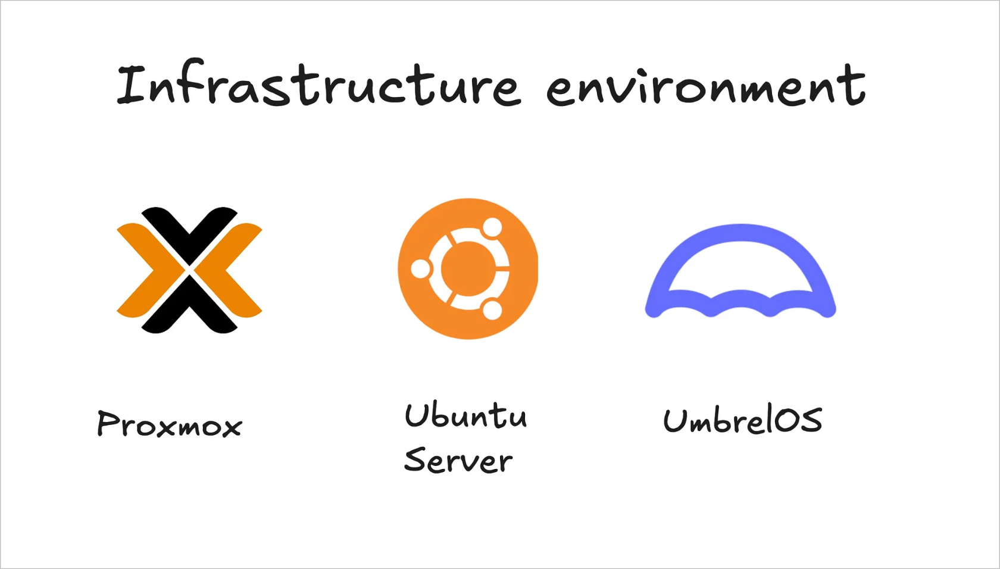
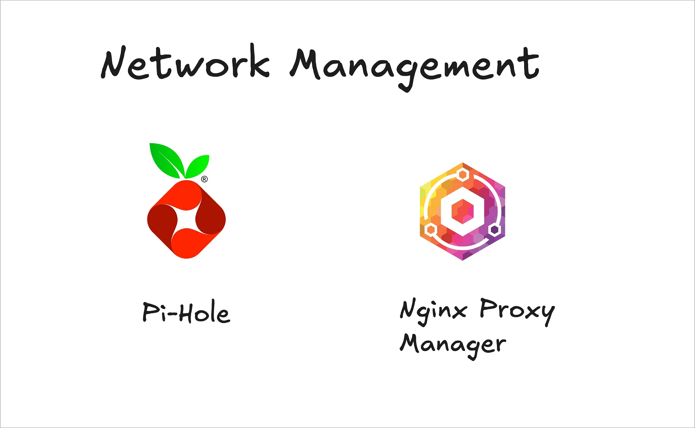
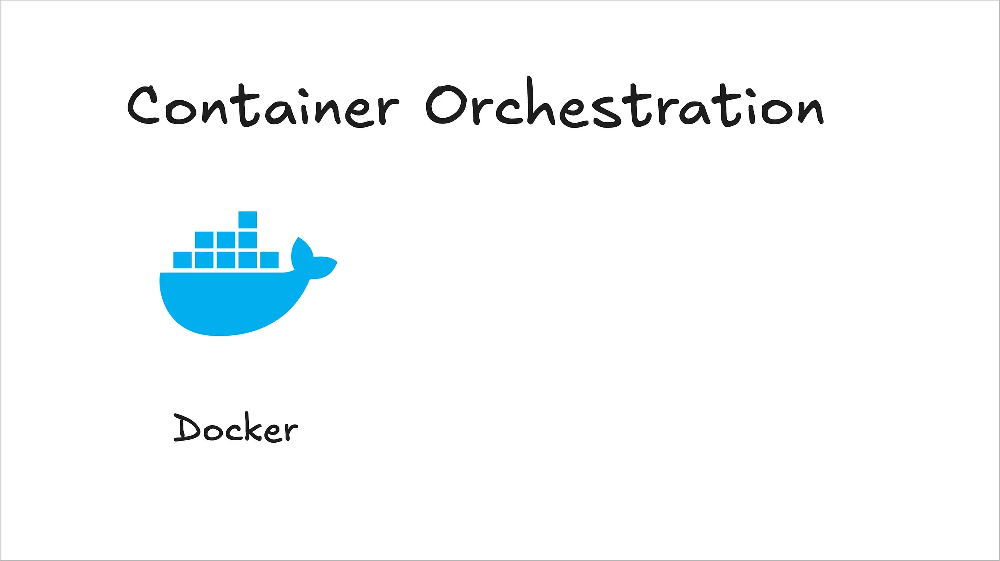
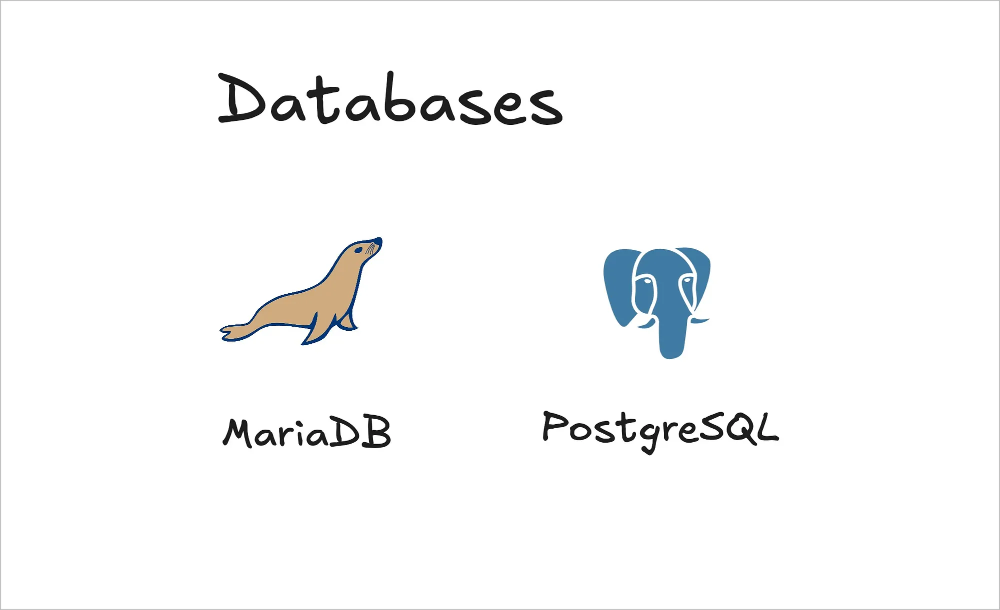
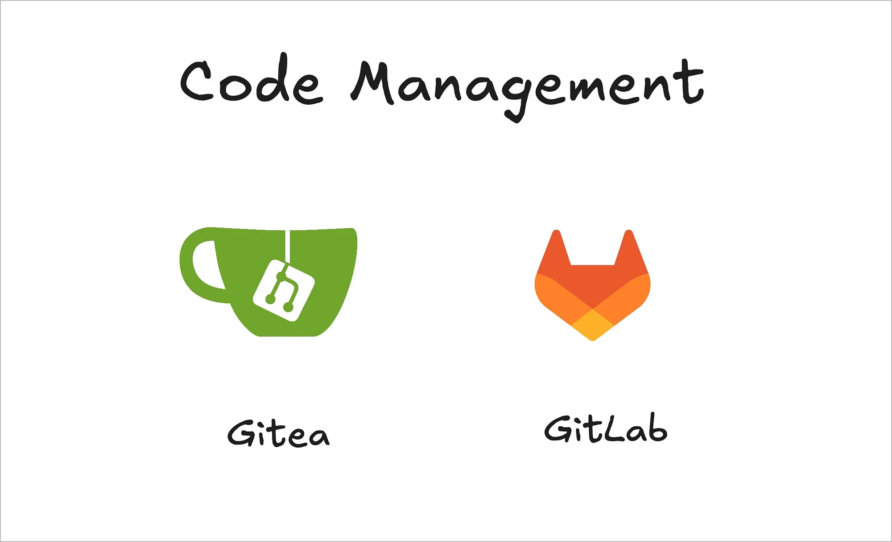
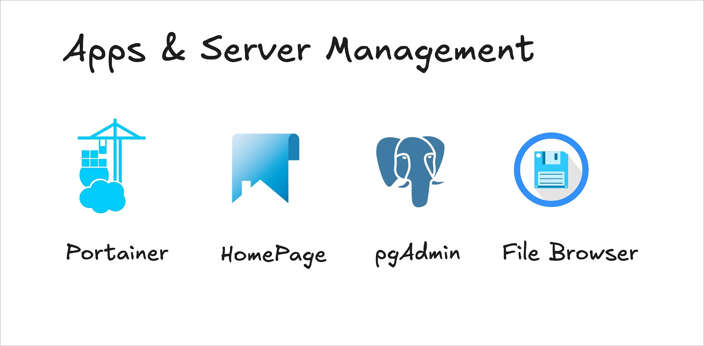
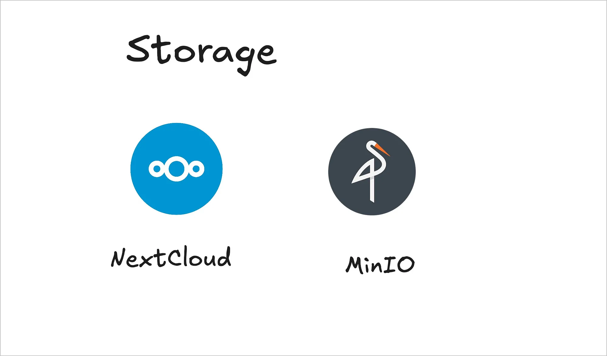
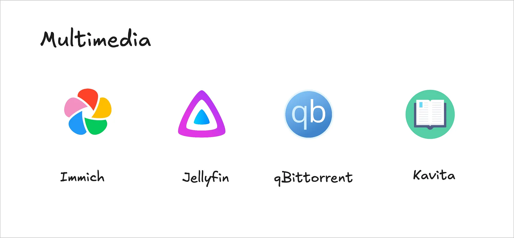
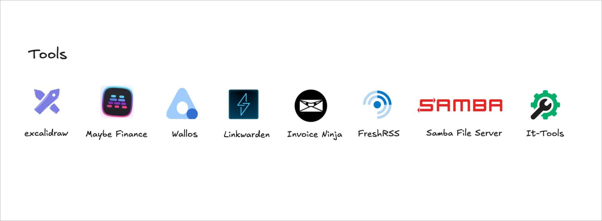
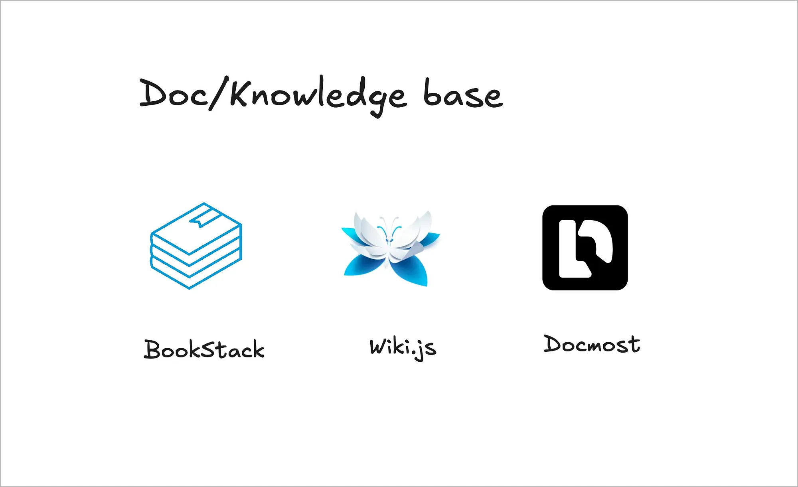

# Stack
This directory contains all the applications running in the VMSLAB homelab environment.

---

## Infrasctructure Environment
Any solid homelab begins with a reliable foundation. For VMSLAB, that foundation is built on a trio of essential components: Proxmox VE, Ubuntu Server, and UmbrelOS. Each serves a distinct purpose, and together they form the backbone of my infrastructure environment.

### Proxmox VE
At the heart of VMSLAB is Proxmox Virtual Environment, a powerful open-source hypervisor that allows me to run both full virtual machines and lightweight Linux containers. What makes Proxmox stand out is its clean web interface, excellent performance, and native support for LXC and KVM, which gives me the flexibility to spin up everything from test environments to full-blown servers.

I use Proxmox to separate services cleanly: some run in containers for speed and resource efficiency, while others are isolated in VMs for security or compatibility reasons. Its built-in features like snapshot management, storage pools, ZFS integration, and high availability clustering (if needed) make it ideal for both beginners and advanced users running home-based infrastructure.

[Proxmox](https://www.proxmox.com/en/products/proxmox-virtual-environment/overview)

### Ubuntu Server

When I need a solid, no-frills Linux environment for application hosting, Ubuntu Server remains my go-to. It’s battle-tested, well-documented, and widely supported, especially in the self-hosting and DevOps world. I rely on it for running more traditional services that don’t require containerization or benefit from direct system access, like web apps, databases, or lightweight cron jobs.

Thanks to its stability and predictable update cycles, Ubuntu Server forms the basis of several critical services in VMSLAB, particularly those that need a consistent and robust environment outside the Docker ecosystem.

[Ubuntu Server](https://ubuntu.com/download/server)

### UmbrelOS

For more experimental services, I’ve integrated UmbrelOS into my stack. Originally designed for running Bitcoin and Lightning nodes, Umbrel has evolved into a beautiful and intuitive OS for self-hosting personal cloud apps. It offers a curated app store that installs services in isolated Docker containers, with a focus on ease of use and data sovereignty.

UmbrelOS runs on a separate node in my setup, functioning as a mini cloud server. While not as customizable as a full Linux distro, it shines in its simplicity and the speed with which you can deploy self-hosted services.

[UmbrelOS](https://umbrel.com/umbrelos)

## Network Managment
No homelab is complete without proper network control. My network stack is kept lean and powerful thanks to two key tools: Pi-hole and Nginx Proxy Manager.

### Pi-hole, Network-Wide Ad & Tracker Blocking

Pi-hole acts as a DNS-level filter for my entire network. It intercepts DNS requests and blocks domains associated with ads, tracking, malware, or telemetry, before they even reach the browser. This means faster page loads, less bandwidth usage, and a cleaner online experience across every device in my home, from desktops and phones to smart TVs and game consoles.

But Pi-hole isn’t just about ad blocking. It’s a valuable security layer. By customizing blocklists and whitelists, I can tailor DNS filtering to my exact needs. I also use it to monitor real-time DNS queries and quickly spot suspicious traffic or misbehaving apps.

In VMSLAB, Pi-hole runs in a lightweight Docker container, accessible via a custom subdomain and secured behind my proxy setup. It’s one of those “set it and forget it” tools that quietly improves everything.

[Pi-Hole](https://pi-hole.net/)

### Nginx Proxy Manager: Simplifying Reverse Proxy and SSL

The second pillar of my network stack is Nginx Proxy Manager (NPM). Instead of manually configuring Nginx through command-line and config files, NPM provides a clean web UI for managing reverse proxy rules. With just a few clicks, I can route internal apps to public-facing domains, manage SSL certificates via Let’s Encrypt, and configure security headers.

This tool is a game-changer for anyone hosting multiple services behind a single IP. For instance:

- cloud.mydomain.com → Nextcloud container
- jellyfin.mydomain.com → Jellyfin instance
- dash.mydomain.com → HomePage dashboard

Thanks to NPM, I don’t have to touch raw Nginx config files, which saves time and reduces human error. Plus, wildcard domains and automatic HTTPS renewals mean less maintenance overhead.

[Nginx Proxy Manager](https://nginxproxymanager.com/)

## Container Orchestration: Managing Apps with Docker

In 2025, containerization isn’t just a DevOps trend, it’s the standard for running modern, portable, and efficient services. At the heart of VMSLAB lies Docker, which powers the majority of applications in my homelab stack. From databases to media servers, most of what runs in VMSLAB lives inside a container.

### Docker

Docker allows me to deploy and isolate services quickly, with minimal overhead. Each app runs in its own container with its own environment and dependencies, which means I can spin up, update, or destroy apps independently, without risking conflicts or system-wide instability.

For example, instead of manually installing Jellyfin, or File Browser on a base OS, I run them in Docker containers. This approach makes upgrades seamless, rollbacks simple (thanks to version tagging), and backups far easier to automate.

Most of my services are defined using Docker Compose files, which let me manage entire stacks with a single command. A typical service definition includes:

- A container image (e.g., jellyfin:latest)
- Volumes for persistent storage
- Networking configuration (often bridged to Nginx Proxy Manager)
- Environment variables for app-specific settings

This structure keeps things reproducible, consistent, and easy to maintain, even months later.

[Docker](https://www.docker.com/)
#### Why No Kubernetes?

You might wonder:

    why not run Kubernetes or k3s for orchestration?

The short answer is: it’s unnecessary for my current use case. VMSLAB is a single-node setup where simplicity and reliability take priority over complexity.

Docker Compose provides everything I need, without the overhead or learning curve of Kubernetes. If I ever scale to a multi-node cluster, I might revisit that decision. But for now, Docker is the perfect fit.

[Kubernetes](https://kubernetes.io/)

## Databases, Reliable Data Management

Behind almost every useful application in VMSLAB lies a structured data layer, and for that, I rely on two trusted database engines: MariaDB and PostgreSQL. Each brings unique strengths to the table, and choosing between them often comes down to the specific needs of the app I’m deploying.

### MariaDB: The Lightweight MySQL-Compatible Option

For apps that require a classic SQL backend and prioritize speed and simplicity, MariaDB is my go-to. It’s a community-driven fork of MySQL, offering full compatibility while improving performance, security, and openness. In my stack, services like Nextcloud or Invoice Ninja work flawlessly with MariaDB.

I run MariaDB with persistent storage mapped to local volumes. It’s lightweight, easy to manage via CLI or a tool like Adminer, and perfect for smaller apps that don’t require complex data models or high concurrency.

[MariaDB](https://mariadb.org/)

### PostgreSQL: Power and Precision When It Counts

When I need a more robust, standards-compliant, and feature-rich SQL engine, I turn to PostgreSQL. This is the backbone for more demanding services in VMSLAB, apps that require advanced queries, strong ACID compliance, JSONB support, or geospatial features.

In particular, apps like Linkwarden, Wallos, and FreshRSS benefit from PostgreSQL’s superior data integrity and indexing capabilities. I manage these databases via pgAdmin, which gives me a GUI-based way to inspect schemas, run queries, and handle backups.

[PostgreSQL](https://www.postgresql.org/)

## Code Management

A well-rounded homelab isn’t just about hosting apps, it’s also a great environment for development and collaboration. In VMSLAB, I use both Gitea and GitLab to manage my source code, repositories, and deployment workflows. Each tool serves a distinct role, allowing me to keep things lightweight when needed, and powerful when it counts.

### Gitea, The Lightweight Git Server That Just Works

Gitea is my go-to solution for personal projects and internal tooling. It’s fast, minimalist, and incredibly easy to deploy via Docker. With a low memory footprint and clean interface, Gitea delivers the core GitHub-like experience, without the overhead or vendor lock-in.

I use Gitea for:

- Hosting personal code and scripts
- Versioning Docker Compose files and configurations
- Managing private experiments or notes in markdown
- Quick collaboration on throwaway projects

The web UI is simple, and setup takes less than 5 minutes. Gitea also includes basic CI integration, issue tracking, and user management, making it more than enough for most solo developers or small teams.

[Gitea](https://about.gitea.com/)

### GitLab, Full-Featured DevOps for Bigger Projects

For more structured, long-term, or collaborative projects, GitLab is my platform of choice. While heavier than Gitea, it offers a full DevOps toolkit, from Git hosting to CI/CD pipelines, container registry, and merge request workflows.

In VMSLAB, GitLab serves a few key roles:

- Hosting large or multi-repository projects
- Automating builds and deployments via GitLab CI
- Storing Docker images in its private container registry
- Integrating with external tools like webhook-based automation

Though it requires more resources, GitLab is invaluable when I need enterprise-grade features on my own infrastructure. It allows me to simulate real-world workflows — great for both learning and prototyping production-ready pipelines.

[GitLab](https://about.gitlab.com/)

## Apps & Server Management: Keeping Control Simple

Running a homelab involves more than deploying services, you need to monitor, manage, and navigate them efficiently. In VMSLAB, I rely on a set of intuitive tools that streamline everything from container orchestration to file access and database administration. These tools don’t just make things easier. They keep the entire system maintainable and enjoyable to use.

Portainer is my go-to dashboard for managing Docker containers. While everything in VMSLAB could be handled via the command line or Compose files, Portainer adds a visual layer that’s incredibly helpful for oversight and quick actions.

With Portainer, I can:

- Start, stop, or restart containers instantly
- Inspect logs, resource usage, and volumes
- Modify environment variables or container configs without downtime
- Manage multiple Docker endpoints if needed

It’s especially useful during debugging or when introducing new containers, providing a clear window into what’s running under the hood — all from a web UI.

[Portainer](https://www.portainer.io/)

### Homepage: A Unified Dashboard for Everything

With dozens of services running, accessing them efficiently is key. That’s where Homepage comes in, a customizable, self-hosted dashboard that displays links to all my services, along with health checks, system stats, and custom widgets.

Each app in VMSLAB is just one click away, with icons, descriptions, and grouping for clarity. It’s the first thing I see when logging into my server, and the hub from which I manage everything else. Plus, Homepage supports:

- Auto-updating service statuses via HTTP checks
- Integration with Docker for container info
- Displaying system metrics like CPU, memory, and uptime

It keeps my ecosystem organized and visually navigable — a huge win for usability.

[homepage](https://gethomepage.dev/)

### pgAdmin: Managing PostgreSQL Without the Terminal

For PostgreSQL management, I use pgAdmin, a powerful web-based GUI that saves me from writing raw SQL in the terminal unless I want to. It’s especially handy when working with complex schemas or analyzing table relationships.

Tasks like creating databases, importing data, reviewing queries, or scheduling maintenance become much more approachable. It integrates directly with the PostgreSQL container in VMSLAB, and access is secured via reverse proxy.

[pgAdmin](https://www.pgadmin.org/)

### File Browser, Web-Based File Access to the Server

Sometimes, you just need to move files around, browse logs, or upload configs — without SSHing into the server. File Browser offers a web interface to the file system with:

- Upload/download functionality - Drag-and-drop file management
- Role-based access control
- Optional text editing directly in the browser

It’s one of those tools that fills a small but critical gap: frictionless file management for a homelab.

[File Browser](https://filebrowser.org/)

## Storage: Managing Personal and Cloud Data

In a world dominated by cloud storage giants, managing your own data can feel like reclaiming control over your digital life. In VMSLAB, that control is made possible through two powerful self-hosted solutions: Nextcloud for file sync and collaboration, and MinIO for scalable object storage.

### Nextcloud, Your Private Cloud, Under Your Terms

Nextcloud acts as my self-hosted alternative to Google Drive, Dropbox, and even parts of Microsoft 365. It’s not just about file storage — it’s about owning the full cloud experience. I use it for:

- Syncing files across devices
- Managing calendars, contacts, and tasks
- Collaborating on documents with Collabora or OnlyOffice integrations
- Sharing files securely with expiring links and permissions

With Docker Compose, deploying Nextcloud in VMSLAB is straightforward. I pair it with MariaDB, Redis (for performance), and a persistent volume for data. Access is secured via Nginx Proxy Manager and HTTPS.

More than just a file server, Nextcloud provides a productivity layer that I can trust — hosted on my own hardware, backed up on my own terms, and 100% under my control.

[Nextcloud](https://nextcloud.com/)

### MinIO: S3-Compatible Object Storage for the Homelab

While traditional file storage works well for personal use, many modern apps benefit from object storage, especially when dealing with large, unstructured data. That’s where MinIO comes in. It’s a high-performance, self-hosted, S3-compatible object storage server, ideal for:

- Backups and archives
- Media libraries
- Hosting data for internal apps and automations

MinIO mimics the AWS S3 API, which means it’s compatible with a wide range of tools and libraries. I use it both as cold storage (for things like database dumps and zipped logs) and as hot storage for apps that support S3 natively.

Running MinIO in Docker gives me flexibility to scale, whether using local disks or external drives. It supports multi-user access, bucket policies, and encryption at rest, all accessible through a simple web UI.

[MinIO](https://min.io/)

## Multimedia, Streaming and Managing Your Content

One of the most satisfying aspects of running a homelab is building your own media ecosystem. In VMSLAB, I’ve crafted a complete suite for managing photos, videos, comics, and downloads, all without relying on third-party platforms. The experience is seamless, beautiful, and entirely under my control.

### Immich: Smart, Private Photo Management

Immich is the backbone of my photo storage and gallery system. Think of it as a self-hosted alternative to Google Photos, but with local storage and no data harvesting. It automatically:

- Syncs media from my phone
- Detects faces and objects using machine learning
- Groups and indexes albums for fast searching
- Supports RAW formats and video playback

Running Immich in Docker is smooth, and its multi-container architecture (PostgreSQL, Redis, machine-learning worker, etc.) scales surprisingly well. It’s one of the most polished and actively developed tools in the self-hosted space right now.

With Immich, my photo collection is fully accessible, smartly organized, and 100% private, without compromising on modern features.

[Immich](https://immich.app/)

### Jellyfin, Streaming Media Without the Middleman

For videos, series, and movies, Jellyfin is my media server of choice. It’s a fully open-source alternative to Plex and Emby, with:

- Rich metadata fetching
- Multi-user support
- Transcoding capabilities (software or hardware-assisted)
- Native apps for Android, iOS, Smart TVs, and web

Jellyfin is connected to my storage volumes and auto-indexes new media as it’s added. I’ve set up streaming access via secure reverse proxy, allowing me to watch my library from anywhere, even when traveling.

It’s the ideal solution for anyone who wants Netflix-style streaming, minus the subscriptions and content restrictions.

[Jellyfin](https://jellyfin.org/)

### Kavita, Reading Made Simple and Beautiful

Kavita fills the gap for digital reading. It’s a self-hosted reader for:

- Manga
- Comics
- eBooks

It supports formats like CBZ, CBR, EPUB, and PDF — and offers a responsive, elegant interface optimized for reading on both desktop and mobile.

I use Kavita to host my entire graphic novel collection, with everything organized into series and volumes. It handles metadata fetching and reading progress tracking, and can even support multiple users.

[Kavita](https://www.kavitareader.com/)

### qBittorrent, Automated Downloads, Fully Controlled

To manage media acquisition, qBittorrent is my trusted torrent client, running headless in a container with web UI access. It’s lightweight, stable, and integrates easily with automation tools if needed.

I’ve configured download directories to match what Jellyfin expects, so once a file is downloaded, it’s automatically detected and added to the media library. Everything stays clean, predictable, and entirely local.

[qBittorrent](https://www.qbittorrent.org/)

## Automation

A homelab isn’t just a collection of services, it’s an ecosystem. And what really brings that ecosystem to life is automation. In VMSLAB, I use n8n, a powerful workflow automation platform, to create smart, event-driven processes that connect my apps and reduce manual effort across the board.

### n8n: Low-Code Automation for Everything

n8n (pronounced “n-eight-n”) is an open-source, self-hosted automation tool that works like a visual programming environment. Think of it as a privacy-focused alternative to Zapier or Make.com, but hosted on your own infrastructure and limited only by your imagination.

I run n8n in a Docker container with persistent storage and external webhook exposure via Nginx Proxy Manager. Once deployed, it becomes a drag-and-drop interface for building complex workflows that interact with REST APIs, databases, file systems, messaging apps, and more.

[n8n](https://n8n.io/)

### Real-World Automations in VMSLAB

Here are a few automations I’ve built with n8n:

- Daily Backups to MinIO: Triggered every night, n8n pulls database dumps from PostgreSQL and MariaDB containers, compresses them, and uploads them to versioned buckets in MinIO.
- New Media Notifications: When a file is added to Jellyfin’s library folder, n8n sends a push notification or email summary.
- Web Monitoring & Alerts: n8n regularly pings key internal services (Nextcloud, Immich, pgAdmin) and sends alerts via Discord or Matrix if one becomes unreachable.
- RSS-to-Download Workflow: n8n parses an RSS feed for new releases and sends matching items to qBittorrent automatically.

These are just starting points, the beauty of n8n is that it scales with your creativity. You can integrate over 350 native services, build custom API calls, and even run custom JavaScript code blocks inline. 

## Productivity & Miscellaneous Tools

In VMSLAB, I’ve gathered a curated selection of self-hosted apps that simplify personal productivity, finances, and digital organization.

### Excalidraw: Visual Thinking Without the Cloud

Excalidraw is a privacy-friendly whiteboard tool that I use for visual brainstorming, network diagrams, or quick UI sketches. Unlike online services like Miro or Figma, it runs entirely in my own environment, with no data leaving my network.

It supports real-time collaboration, local file exports, and integration with Nextcloud for versioned backups. It’s fast, distraction-free, and great for translating messy ideas into structured visuals.

[Excalidraw](https://excalidraw.com/)

### Maybe Finance, Simple Budgeting, Self-Hosted

Maybe Finance is my minimalist approach to financial tracking. It connects to bank feeds (or imports CSVs), visualizes spending patterns, and helps me set personal budgeting goals, all without relying on Mint or YNAB.

I self-host it using Docker and secure it behind authentication and HTTPS via Nginx Proxy Manager. While not as flashy as commercial tools, it’s private, functional, and good enough for light personal finance management.

[Maybe Finance](https://maybefinance.com/)

### Wallos, Tracking Subscriptions and Recurring Payments

Wallos helps me keep track of all my subscriptions in one place. Wallos provides:

- A clear view of recurring payments
- Reminders before renewals
- Categorization and monthly total tracking
- Support for multi-currency expenses

I host Wallos in Docker, with persistent storage and SSL-secured access. It’s a simple but valuable tool to avoid forgotten renewals or budget surprises, especially when managing multiple digital services, both personal and professional.

[Wallos](https://wallosapp.com/)

### Linkwarden: A Better Way to Save the Web

Instead of saving bookmarks to a browser or third-party sync service, I use Linkwarden, a beautiful, modern bookmark manager. It allows me to:

- Save links with metadata and full-page snapshots
- Organize bookmarks by tag or collection
- Search through saved pages, even offline

Running in Docker, Linkwarden makes archiving the web effortless, and permanent. It’s an invaluable tool for research, reading lists, and organizing knowledge over time.

[Linkwarden](https://linkwarden.app/)

### Invoice Ninja: Full-Featured Invoicing, No SaaS Required

For managing personal or freelance billing, Invoice Ninja is a beast. It handles:

- Custom invoice templates
- Recurring billing
- PDF exports
- Payment tracking
- Client management

Hosted on my own server with MariaDB, it’s a professional-grade invoicing platform that rivals many SaaS options, minus the monthly fees or data exposure.

[Invoice Ninja](https://invoiceninja.com/)

### FreshRSS, The Joy of Following the Web

FreshRSS replaces my need for Feedly or Inoreader. It’s fast, self-hosted, and lets me follow blogs, news outlets, tech sites, and changelogs, all in one place.

I use it to stay updated on:

- Open-source project updates
- Cybersecurity news
- Tech blogs and newsletters

With OPML import/export and mobile-friendly interfaces, FreshRSS keeps me informed without algorithmic feeds or ads.

[FreshRSS](https://freshrss.org/index.html)

### Samba — Fast, Local File Sharing Across Devices

For seamless file transfers between my homelab and LAN devices, I use Samba to expose shared directories over SMB.

[Samba](https://wiki.samba.org/index.php/Main_Page)

### IT-Tools — A Swiss Army Knife for Devs and Admins

IT-Tools is a browser-based toolbox packed with useful utilities: JSON/HTML formatters, JWT decoders, regex testers, timestamp converters, and more. It’s lightning fast, no internet required, and perfect for dev/debug sessions — directly in the browser, hosted locally.

[IT-Tools](https://it-tools.tech/)

## Knowledge Management, Centralizing Documentation

Every homelab grows, and with that growth comes complexity. To avoid chaos and keep everything documented, I’ve built a structured, self-hosted knowledge base using a trio of complementary tools: BookStack, Wiki.js, and Documost. Each serves a distinct purpose, depending on the type of content I need to store or reference.

#### BookStack, Organized, Opinionated Documentation

BookStack is my go-to tool for structured, internal documentation. It organizes content into a hierarchy of Books → Chapters → Pages, making it ideal for:

- Infrastructure documentation
- Docker Compose notes
- Installation guides
- Personal tech how-tos

It’s intuitive, markdown-friendly, and perfect for creating manuals that are easy to browse and maintain. I especially appreciate the role-based access control and version history features, great for avoiding accidental loss of critical config notes.

[Bookstack](https://www.bookstackapp.com/)

### Wiki.js: Rich, Flexible Knowledge Base

For more flexible, dynamic content, I turn to Wiki.js. It’s a powerful, modern wiki platform that supports:

- Multiple editors (Markdown, WYSIWYG, HTML)
- Git-backed version control
- Media management and file attachments
- Advanced permissions and SSO support

In VMSLAB, I use Wiki.js as a more collaborative and extensible knowledge hub, suitable for broader topics, multi-user contributions, and content that evolves often (like self-hosted app comparisons, automation flowcharts, or research logs).

It’s heavier than BookStack, but the customizability and plugin support make it an excellent long-term tool for growing documentation needs.

[Wiki.js](https://js.wiki/)

### Docmost: Fast, Minimalist Markdown Notes

Sometimes, you just want to write — quickly. Docmost fills that gap as a lightweight, no-nonsense markdown note-taking platform. It’s ideal for:

- Daily tech logs
- Bash snippets
- To-do lists or service migration notes
- Fast prototyping of future setups

I self-host Docmost for its simplicity, speed, and zero distraction interface. It boots in seconds, works offline, and lets me focus on content without dealing with page structures or formatting quirks.

[Docmost](https://docmost.com/)